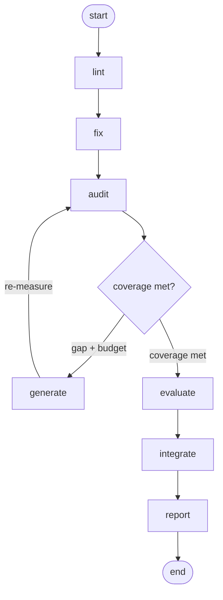

# The seven steps

> **Generated file — do not edit by hand.** This document is rendered from
> `web/src/wiki/content.ts`, the single source of truth it shares with the
> pyverdex wiki (the "Understand → The seven steps" pages). Regenerate with
> `cd web && npm run gen:docs`.

pyverdex runs as a **deterministic LangGraph pipeline**: seven compiled subgraphs,
each with exactly one job. Line coverage alone proves a line *ran*, not that anything
*checked* it — so pyverdex measures seven dimensions instead of one, and only a step
that survives its gate counts. Steps are one of two kinds:

- **Deterministic** steps (`lint`, `audit`, `report`) measure. No model touches
  them, so identical input gives identical output — that is what makes the report
  trustworthy.
- **Judgment** steps (`fix`, `generate`, `evaluate`, `integrate`) ask an LLM to
  author or assess. Each one that changes your repo sits behind a **human gate**.

The spine of the pipeline is the **audit⇄generate loop**: `audit` measures and decides
whether coverage targets are met; while a gap remains and the cycle budget is unspent,
`generate` authors tests and hands control back to `audit` to re-measure.

## Pipeline at a glance

| # | Step | Kind | Gate | What it does |
| --- | --- | --- | --- | --- |
| 01 | [`lint`](#01-lint) | deterministic | auto | Static health floor — style, likely bugs, leaked secrets. |
| 02 | [`fix`](#02-fix) | mixed | human gate | Auto-fix the mechanical, propose a plan for the rest. |
| 03 | [`audit`](#03-audit) | deterministic | auto | The measurement core — and the pivot of the loop. |
| 04 | [`generate`](#04-generate) | judgment | human gate | Author tests for the gaps — and prove they are strong. |
| 05 | [`evaluate`](#05-evaluate) | judgment | auto | Judge whether tests exercise real seams or just mocks. |
| 06 | [`integrate`](#06-integrate) | judgment | human gate | Propose integration tests that hit real boundaries. |
| 07 | [`report`](#07-report) | deterministic | auto | Merge every dimension into one verdict. |

---

## 01. lint

`deterministic` · `auto`

**In one line.** Static health floor — style, likely bugs, leaked secrets.

### What it does

Runs the linters over the source tree and scans for committed secrets. No LLM. It is the cheap first pass that catches defects you should never pay dynamic-analysis time to find.

### Why this step exists

Cheapest signal first. Static defects (style, type errors, security smells, dead code) and committed secrets need neither the test suite nor a model to find — a parser sees them. Catching them here means you never spend coverage or LLM budget on a problem the AST already knows about, and it hands `fix` a concrete worklist.

### How it operates

Internally, `lint` runs as its own compiled subgraph. Its phases, in order:

1. SCAN — walk the source root for Python modules.
2. RUN-LINTERS — drive the vendored lint_reporter, which fans out to ruff (style + likely bugs), mypy (types), bandit (security/SAST) and vulture (dead code), plus the secret scanner.
3. AGGREGATE — fold every finding into one typed LintReport (issue and error counts per tool).
4. EMIT — publish lint_report into graph state. It classifies only; it never fails the build on findings.

### How it determines coverage

Feeds the lint dimension of the unified report (pass when zero errors, fail on any error). It is orthogonal to line/branch/mutation — the static floor, true whether or not a single test ran.

### Example

An unused import or a hard-coded API key never moves the coverage %, but vulture and the secret scanner flag both here, before any test runs.

### What it drives next

A lint_report in state that `fix` acts on and `report` rolls up. No gate, so the run flows straight into `fix`.

### Reads & writes

| Field | Value |
| --- | --- |
| Kind | Deterministic — no LLM; identical output for identical input. |
| Gate | auto — it only reads and classifies; it changes nothing on disk, so there is nothing to approve. |
| Input | source tree |
| Output | lint findings + secret hits (the lint dimension) |
| Tools | `lint_reporter`, `secret_scanner` |

---

## 02. fix

`mixed` · `human gate`

**In one line.** Auto-fix the mechanical, propose a plan for the rest.

### What it does

Applies `ruff --fix` for the safely-automatable findings (deterministic), then asks the LLM for a remediation *plan* for what is left. Propose-only: it does not rewrite your logic unattended, which is why it is gated for human approval by default.

### Why this step exists

Lint findings split in two: mechanical ones a tool rewrites safely, and judgement ones that need a human. `fix` clears the mechanical class automatically and turns the rest into a reviewable plan — so trivial defects are gone before measurement without ever silently rewriting your logic.

### How it operates

Internally, `fix` runs as its own compiled subgraph. Its phases, in order:

1. RUFF-FIX — run `ruff check --fix` over the source: only ruff's safe, mechanical autofixes, applied deterministically.
2. RE-LINT — re-run the linter to confirm what remains and refresh lint_report, so the fix is verified rather than assumed.
3. LLM-PLAN — for the non-ruff remainder (mypy/bandit/vulture), if a backend is configured, ask the model for a concise file-by-file remediation plan — prose, never code patches.
4. GATE — pause at the human gate (gated by default) so a person approves before the run continues.

### How it determines coverage

Indirect. By clearing trivial lint it lifts the lint dimension; it authors no tests and moves no line/branch/mutation number.

### Example

ruff auto-removes the unused import; the mypy type error and a bandit `subprocess(shell=True)` finding become a short plan you approve, not a silent rewrite.

### What it drives next

A fix_report (ruff result + remaining count + optional remediation plan) and a refreshed lint_report. Control then passes to `audit`.

### Reads & writes

| Field | Value |
| --- | --- |
| Kind | Mixed — a deterministic part plus an LLM-proposed part. |
| Gate | gated — it can modify files (ruff --fix) and proposes changes to your code, so it stops for approval by default; the non-mechanical part is propose-only and never hand-edited unattended. |
| Input | lint findings |
| Output | applied trivial fixes + an LLM remediation plan (proposed) |
| Tools | `lint_reporter (ruff --fix)` |

---

## 03. audit

`deterministic` · `auto`

**In one line.** The measurement core — and the pivot of the loop.

### What it does

Runs the test suite under coverage.py, then measures per-function line gaps, branch structure, boundary tiers, cross-package edges, and assertion quality. It computes whether every function meets its tier target and sets `coverage_met`. This is where the audit⇄generate loop decides whether to keep going.

### Why this step exists

This is the heart of pyverdex. Line coverage alone lies — it proves a line ran, not that anything checked it. `audit` measures every dimension a single % hides, and it is the only step that decides whether the suite is actually good enough. That verdict — `coverage_met` — is the pivot the whole loop turns on.

### How it operates

Internally, `audit` runs as its own compiled subgraph. Its phases, in order:

1. COLLECT — run the target test suite under coverage.py (best-effort) to produce a .coverage data file.
2. SNAPSHOT — derive per-function line gaps (coverage_analyzer), cross-package call edges (--edges), branch structure (branch_mapper), boundary/critical tiers (boundary_classifier), assertion quality (assertion_quality) and log-path coverage (log_contract_validator), each from its own deterministic tool.
3. SCORE — for every function compare its line % against its tier target — critical 95 for boundary functions, standard 85 otherwise, or a lower cold 70 for modules configured as cold paths — mark anything below as a gap, rank modules worst-first and flag critical modules.
4. EMIT — set coverage_met (true only when nothing is below its tier target) and write the gap report + coverage state.

### How it determines coverage

This is where coverage is determined. It computes the multi-dimensional measurement for every function and the pass/fail of the line dimension against tier thresholds; every downstream step reads its numbers.

### Example

A function is 100% line-covered, but its `else:` branch never runs and its only test asserts nothing — audit's branch and assertion dimensions surface exactly what the line % hid.

### What it drives next

audit_gap_report, coverage_state, and the coverage_met boolean. The after_audit edge then routes to `generate` (a gap remains and budget is left) or falls through to evaluate/integrate/report.

### Reads & writes

| Field | Value |
| --- | --- |
| Kind | Deterministic — no LLM; identical output for identical input. |
| Gate | auto — pure measurement, deterministic and read-only. There is nothing to approve, and identical inputs always yield identical numbers. |
| Input | source + test suite |
| Output | per-function multi-dimensional measurements + coverage_met |
| Tools | `coverage.py`, `coverage_analyzer`, `branch_mapper`, `boundary_classifier`, `coverage_analyzer --edges`, `assertion_quality`, `log_contract_validator` |

---

## 04. generate

`judgment` · `human gate`

**In one line.** Author tests for the gaps — and prove they are strong.

### What it does

For each gap the audit found, the LLM authors a candidate test. In apply-mode it writes the test, runs it green, then gates it on `mutation_runner`: the test must kill 100% of mutants or it is re-strengthened with the surviving mutants fed back to the model. Only tests that pass the mutation gate stick — then `audit` re-measures. This is the loop that actually closes gaps.

### Why this step exists

Measuring a gap doesn't close it. `generate` is the step that actually moves coverage — it authors the missing tests. But an authored test is only worth keeping if it is strong, so each must pass the mutation gate (kill 100% of injected bugs) before it counts. This is the loop that turns a red audit green.

### How it operates

Internally, `generate` runs as its own compiled subgraph. Its phases, in order:

1. SELECT — pick the unhandled below-target gaps, up to loop.max_gaps_per_cycle (10).
2. AUTHOR — the LLM writes one pytest module per gap (system prompt distilled from the assertion-policy + layer-unit knowledge), requiring ≥ assertion_min meaningful assertions.
3. GATE — human approval (gated by default) before anything is written.
4. APPLY (only when generate.apply=true) — write the test, check it parses, run it green, then run mutation_runner on the target function; it must reach mutation_kill_rate (1.0) or the surviving mutants are fed back and the test is re-authored, bounded by restrengthen_attempts. Only passing tests stick and the gap is marked handled.
5. RE-MEASURE — control returns to `audit`, which re-runs and updates coverage_met.

### How it determines coverage

The only step that raises coverage — it closes line gaps with new tests, and the mutation gate guarantees those tests actually verify, driving the mutation dimension to a 100% kill-rate.

### Example

audit finds price() 60% covered; generate writes a test, but flipping `a + b` → `a - b` still passes, so a mutant survives — it re-strengthens the assertions until that mutant dies, then keeps the test.

### What it drives next

Candidate tests (apply-mode: written to pyverdex_generated/, mutation-gated, recorded with kill-rate + gate status), gen_handled updated, and the audit⇄generate loop either continues or exhausts at loop.max_cycles.

### Reads & writes

| Field | Value |
| --- | --- |
| Kind | LLM judgment — calls the configured model behind a gate. |
| Gate | gated — it writes test files and runs model-authored code, a material change to your repo, so it stops for approval. Off by default (apply=false): propose-only, nothing written unattended. |
| Input | coverage gaps from audit |
| Output | candidate tests (apply-mode: written + mutation-gated) |
| Tools | `mutation_runner` |

---

## 05. evaluate

`judgment` · `auto`

**In one line.** Judge whether tests exercise real seams or just mocks.

### What it does

Looks at the existing suite and judges integration effectiveness — are real services exercised, or is everything mocked into meaninglessness? Feeds the integration/system dimension.

### Why this step exists

A green suite can still be a lie if every external dependency is mocked — it only proves the mocks returned what you told them to. `evaluate` decides which boundaries deserve a real-service test, ranked by how much risk a real test would buy, so integration effort goes where mocks are most dangerous.

### How it operates

Internally, `evaluate` runs as its own compiled subgraph. Its phases, in order:

1. CLASSIFY — take the boundary functions that still carry line gaps from the audit snapshot and categorise each as db / api / queue / file / cli.
2. SCORE — rank each candidate by replacement value, score = tier_weight × risk_weight × coverage_gap, so the riskiest under-tested seams rise to the top.
3. PATTERN — assign a lifecycle pattern per category (db → transaction-rollback, api → vcrpy, queue → celery-test-harness, file → tmp_path, cli → subprocess-capture).
4. GATE — pass through the gate (auto by default) and hand the ranked strategies to `integrate`.

### How it determines coverage

Feeds the integration/system dimension. It changes no line number — it judges whether the seams between real services are exercised and queues the ones that aren't.

### Example

A payments.charge() boundary is mocked everywhere; evaluate scores it high (api risk 4 × runtime tier 3 × its gap) and tags it `vcrpy`, putting it at the top of the integration queue.

### What it drives next

A ranked integration_strategies list (each with category, risk, score and a lifecycle pattern) for `integrate` to act on.

### Reads & writes

| Field | Value |
| --- | --- |
| Kind | LLM judgment — calls the configured model behind a gate. |
| Gate | auto — it only classifies and ranks; it proposes nothing to your files, so it runs unattended. The real approval happens at `integrate`. |
| Input | test suite + measurements |
| Output | integration-effectiveness assessment |
| Tools | — |

---

## 06. integrate

`judgment` · `human gate`

**In one line.** Propose integration tests that hit real boundaries.

### What it does

Authors candidate integration tests for the unwired seams `evaluate` flagged. Propose-only today; the apply-mode hooks (flakiness + cassette secret-scanning gates) are wired for when you opt in.

### Why this step exists

`evaluate` says what to integrate; `integrate` proposes how — a concrete real-service test using the assigned lifecycle pattern. Because real-service tests touch databases, APIs and recorded cassettes, it hard-gates: nothing lands without review, and (when applied) flakiness and cassette-secret checks run before anything is trusted.

### How it operates

Internally, `integrate` runs as its own compiled subgraph. Its phases, in order:

1. PLAN — queue the ranked strategies (ordered by replacement value), up to loop.max_gaps_per_cycle.
2. CONVERT — for each, the LLM proposes a real-service integration test using the assigned pattern (testcontainers / vcrpy / tmp_path / …).
3. GATE — hard human approval before anything is applied. This build is propose-only; the apply-mode hooks — flakiness_checker (≥10 reruns, ≤2% fail) and secret_scanner over recorded cassettes — are wired for when you opt in.

### How it determines coverage

Improves the integration dimension by replacing mocks with real seams. Like generate it adds tests, but at the system boundary rather than the unit.

### Example

integrate drafts a vcrpy-backed test for payments.charge() that records one real API round-trip, then pauses — you review the cassette for leaked keys before it is kept.

### What it drives next

Candidate integration tests appended to `generated` (proposed), awaiting the gate. Control then passes to `report`.

### Reads & writes

| Field | Value |
| --- | --- |
| Kind | LLM judgment — calls the configured model behind a gate. |
| Gate | gated — real-service tests are the highest-risk thing the pipeline writes (live dependencies, recorded secrets), so it always stops for approval. |
| Input | integration assessment |
| Output | candidate integration tests (proposed) |
| Tools | `flakiness_checker`, `secret_scanner` |

---

## 07. report

`deterministic` · `auto`

**In one line.** Merge every dimension into one verdict.

### What it does

Merges all dimensions per function into the UnifiedCoverageReport and writes `coverage-report.{json,html}`. Computes the overall verdict: fail if any dimension fails, warn if any did not run, else pass. This is the headline output — the dashboard you see in the Playground.

### Why this step exists

Seven dimensions across many functions are useless as scattered numbers. `report` turns them into one answer — a per-function table, dimension rollups, and a single pass/warn/fail verdict — and persists it as the JSON + HTML you actually read and the Playground dashboard renders.

### How it operates

Internally, `report` runs as its own compiled subgraph. Its phases, in order:

1. ASSEMBLE — merge every dimension's per-function measurement into the UnifiedCoverageReport.
2. ROLL-UP — reduce each dimension to a status (line fails if any function is below tier; mutation passes at ≥ kill-rate; assertion fails on weak tests; …) and compute the overall verdict: fail if any dimension failed, warn if any didn't run, else pass.
3. WRITE — persist coverage-report.json and coverage-report.html to the report dir.

### How it determines coverage

It doesn't measure coverage — it adjudicates it, combining every dimension into the headline verdict, so 'passing' means every dimension passed, not just lines.

### Example

Lines pass at 96%, but one surviving mutant fails the mutation dimension — report's overall verdict is fail, exactly the honest signal line coverage alone would have hidden.

### What it drives next

unified_coverage in state, the written report files, and the overall status — the headline output the dashboard shows.

### Reads & writes

| Field | Value |
| --- | --- |
| Kind | Deterministic — no LLM; identical output for identical input. |
| Gate | auto — it only reads measurements and writes a report; there is nothing to approve. |
| Input | all dimension measurements |
| Output | coverage-report.{json,html} + overall verdict |
| Tools | — |

---

## The loop and its budgets

The `generate → audit` self-loop continues while coverage targets are unmet, the cycle
cap is not hit, and `generate` still has unhandled gaps; otherwise control falls through
to `evaluate → integrate → report`.

### Thresholds (`config/default.yaml`)

| Key | Default | Meaning |
| --- | --- | --- |
| `line_critical` | `95.0%` | Line target for boundary / critical functions. |
| `line_standard` | `85.0%` | Line target for ordinary functions. |
| `line_cold` | `70.0%` | Line target for cold / rarely-run code. |
| `mutation_kill_rate` | `1.0` | generate gate: 100% of mutants must be killed. |
| `assertion_score` | `0.5` | Minimum assertion-quality score. |
| `assertion_min` | `2` | Minimum real assertions per generated test. |
| `flakiness_max_fail_rate` | `0.02` | Max tolerated flaky-fail rate (2%). |
| `flakiness_min_runs` | `10` | Re-runs used to detect flakiness. |

### Loop bounds

| Key | Default | Meaning |
| --- | --- | --- |
| `loop.max_cycles` | `3` | Bound on the audit⇄generate loop (the 'Ralph budget'). |
| `loop.max_gaps_per_cycle` | `10` | Gaps generate will tackle per cycle. |

### Generate apply-mode

| Key | Default | Meaning |
| --- | --- | --- |
| `generate.apply` | `false` | true ⇒ write tests to disk + re-audit (closes the loop). Off by default — nothing written unattended. |
| `generate.restrengthen_attempts` | `1` | Re-author cycles when mutants survive. |
| `generate.mutation_max_lines` | `20` | Cap on lines mutated per gap (keeps the gate fast). |

## The seven coverage dimensions

The steps above produce these seven dimensions; `report` merges them into one verdict
(**fail** if any dimension failed, **warn** if any did not run, else **pass**).

| Dimension | The question it answers | Measured by |
| --- | --- | --- |
| **Line coverage** | Did each line of code actually run while the tests executed? | `coverage.py + coverage_analyzer` |
| **Branch coverage** | Which branches (if/else, loops, except) exist in each function, and are they all exercised? | `branch_mapper` |
| **Edge / function-to-function** | Which cross-package call seams (function A → function B) are actually wired together by a test? | `coverage_analyzer --edges` |
| **Mutation kill-rate** | If the code is deliberately corrupted, do the tests notice and fail? | `mutation_runner` |
| **Assertion quality** | Are the tests making meaningful checks, or are they padding? | `assertion_quality` |
| **Integration / system** | Are real services exercised end-to-end, or is everything mocked? | `evaluate / integrate (judgment)` |
| **Lint / security / secrets** | Is the code statically healthy — style, likely bugs, leaked secrets? | `lint_reporter + secret_scanner` |
